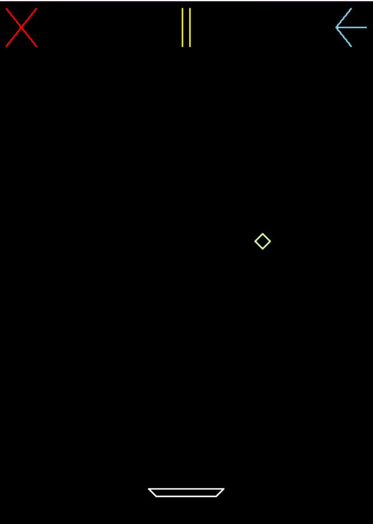

# 💎 Diamond Catcher  

A simple **Diamond Catcher** game built with **Python and OpenGL**. The player moves a catcher left and right using the **arrow keys** to catch falling diamonds and score points.

## 🎮 Features  
- **Catch the Diamonds**: Move the catcher to grab falling diamonds.  
- **Score Tracking**: See how many points you can achieve!  
- **GUI Functionalities**: Pause, resume, restart, and exit through the graphical interface.  

## 🛠️ Technologies Used  
- **Python**  
- **OpenGL (PyOpenGL)**  
- **Pygame (for event handling & window management)**  

## 🎮 Controls  
| Key | Action |
|------|--------|
| ← | Move left |
| → | Move right |

## 📷 Screenshots  

